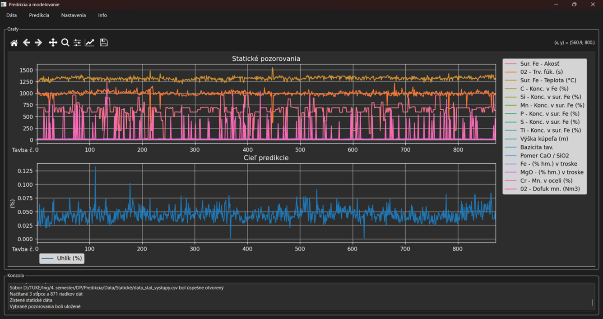
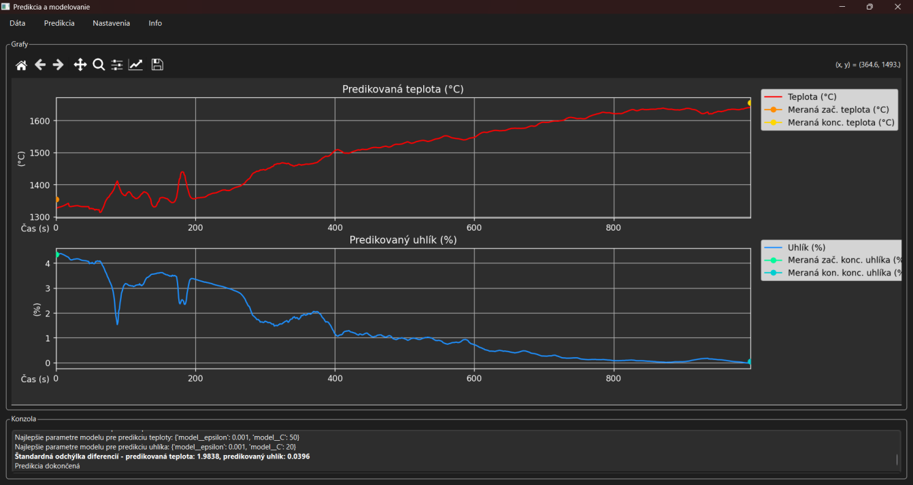
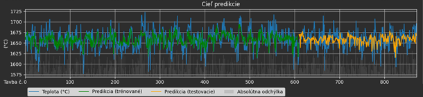
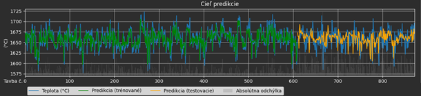
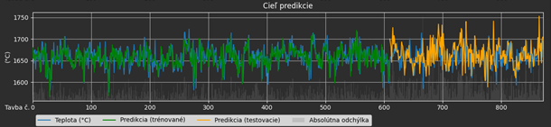
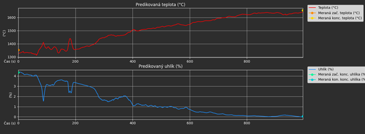
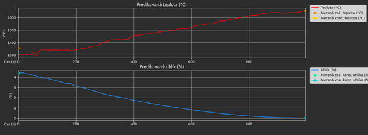
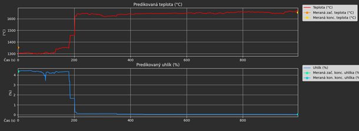
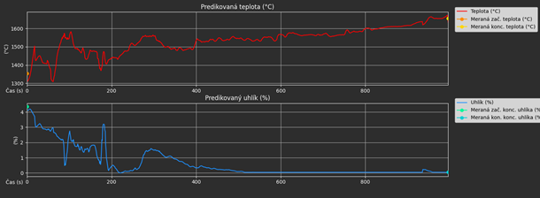

# Predikcia teploty a uhlíka pri výrobe oceli na báze strojového učenia

Tento program bol vytvorený ako súčasť diplomovej práce na tému predikcie teploty a koncentrácie uhlíka v procese výroby ocele pomocou strojového učenia.

## Ako spustiť

1. Nainštaluj požadované knižnice:

	pip install -r requirements.txt

2. Spusti program:

	python Predikcia.py

## Hlavné požiadavky

- Python 3.8+
- PySide6
- matplotlib
- pandas
- sklearn

Odkaz na Git:
https://github.com/BlueScreenOfREKT/predikcia-teploty-uhlika

Okno aplikácie po načítaní dát statických dát a nameraného cieľa predikcie:

Výsledok predikcie na statických a dynamických pozorovaniach:

Predikcia teploty modelom SVR (rbf) na statických dátach:

Predikcia teploty modelom SVR (poly) na statických dátach:

Predikcia teploty modelom RF na statických dátach:

Predikcia teploty modelom MLP na statických dátach:

Predikcia teploty a uhlíka modelom SVR (rbf) na statických aj dynamických pozorovaniach:

Predikcia teploty a uhlíka modelom SVR (poly) na statických aj dynamických pozorovaniach:

Predikcia teploty a uhlíka modelom RF na statických aj dynamických pozorovaniach:

Predikcia teploty a uhlíka modelom MLP na statických aj dynamických pozorovaniach:

